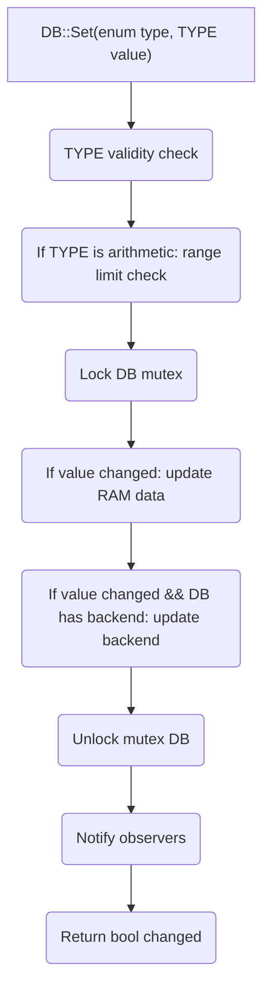
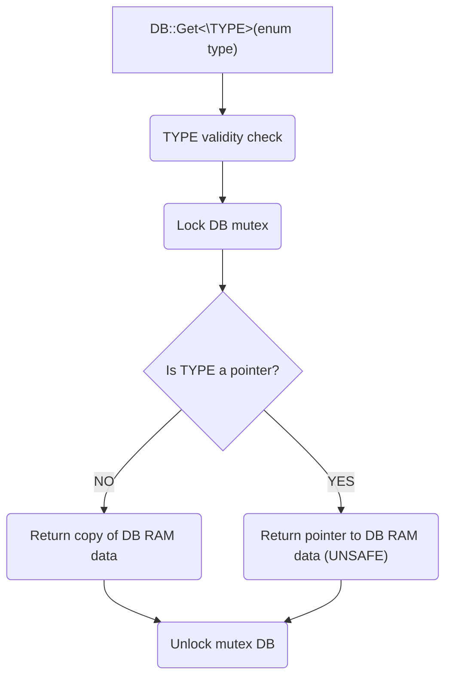
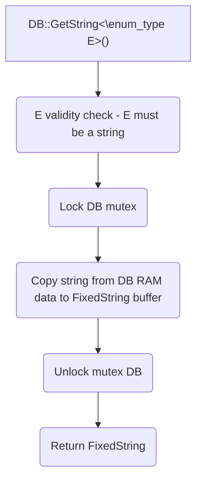

# ShoobyDB 🐻
**Lightweight configurations database for real time embedded systems in c++20**

This is header only library to easily define a set of heterogeneous data configurations as a database and access them in a thread safe manner.

---
## Table of Contents
- [ShoobyDB](#shoobydb)
  - [Table of Contents](#table-of-contents)
  - [Basic Usage](#basic-usage)
  - [Features](#features)
  - [API](#api)
    - [DB::Set](#dbset)
      - [Flowchart](#flowchart)
    - [DB::Get](#dbget)
      - [Flowchart](#flowchart-1)
    - [DB::GetString](#dbgetstring)
      - [Flowchart](#flowchart-2)


## Basic Usage
```cpp
struct IPV4
{
    uint8_t ip[4];
};

// define a connectivy configuration database
#define CONNECTIVITY_CONFIG(CONFIG_NUM, CONFIG_STR, CONFIG_BLOB) \
    CONFIG_NUM(ALWAYS_CONNECT, bool, true)                       \
    CONFIG_NUM(PORT, uint16_t, 1883)                             \
    CONFIG_STR(HOST, "localhost", 32)                            \
    CONFIG_BLOB(IP, IPV4, {192, 168, 1, 1})                      \
    CONFIG_NUM(CONNECTION_RETRIES, uint8_t, 3, 1, 10)

DEFINE_SHOOBY_META_MAP(CONNECTIVITY_CONFIG)

int main()
{
    Shooby::DB<CONNECTIVITY_CONFIG>::Init(/* some backend */);

    using enum CONNECTIVITY_CONFIG::enum_type;
    using conn_db = Shooby::DB<CONNECTIVITY_CONFIG>;

    // set something
    conn_db::Set(HOST, "google.com");

    // get something
    auto port = conn_db::Get<uint16_t>(PORT);

    // profit!
    printf("using port: %d\n", port);
}

```


## Features
- Straightforward defenition of a DB instance with a list of enums
- Convenient API for setting and getting values
- Lightweight and fast
- Type safety with C++20 concepts, constexpr, consteval and static_asserts
- Observers capabilites for notifying when a value changes
- Backend capabilites for saving and loading the database to/from a file/flash/kvstore
- Thread safe
- Portable using a preprocesser macro to define the mutex api, print api and assert api

## API

### DB::Set
Use **bool DB::Set\<TYPE\>(enum_type e, TYPE value)** to set a value in the database.
* Parameters:
  * enum_type e: enum of the value to set
  * TYPE value: value to set
* Template parameter:
  * TYPE: type of the value to get
* Returns:
  * bool: true if the value changed, false if not


- TYPE can be an arithemtic/blob/char pointer/blob pointer
- If operation is successful, observers will be called in a linked list layer, observers are always called whether the value changed or not. A boolean paramter is passed to the observer to indicate if the value changed or not.

#### Flowchart


### DB::Get
Use **TYPE DB::Get\<TYPE\>(enum_type e)** to get a value from the database.
* Parameters:
  * enum_type e: enum of the value to get
* Template parameter:
  * TYPE: type of the value to get
* Returns:
  * TYPE: copy of the value in the database OR pointer to the value in the database


- TYPE can be a pointer though it is not recommended because it will return a pointer to the underlying data in the database. If the database is updated, the pointer will be invalidated.
- For strings it is recommended to use **DB::GetString<enum_type e>()** which returns a Shooby::FixedString which is a wrapper for char array in the size of the string max length.

#### Flowchart

### DB::GetString
Use **FixedString<size_t LEN> DB::GetString\<enum_type E\>()** to get a safe string from the database.
* Parameters:
* Template parameter:
  * E: enum of the string value to get
* Returns:
  * FixedString: copy of the string in the database in a buffer of the max size of the string config as defined in the Shooby::MetaMap

- For the FixedString API see shooby_utilities.h : FixedString

#### Flowchart

